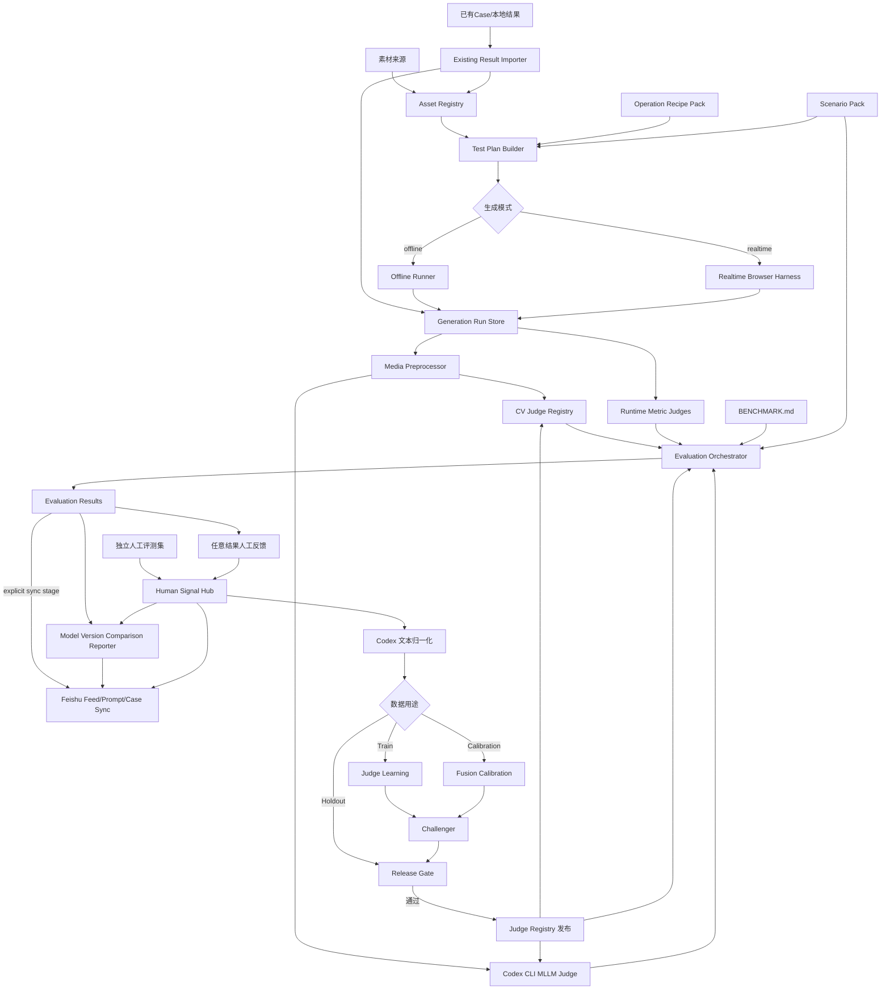

# 整体技术架构

本文只说明组件边界、主流程和依赖方向；字段细节见 `data-contracts.md`，评测标准见根目录 `BENCHMARK.md`。

## 1. 架构目标

- 同时支持离线和实时生成测试。
- 对同一个 Feed × Prompt 进行可复现的重复生成。
- 将生成运行事实、视觉判断和人工评价分开存储。
- 允许评测维度和 Judge 独立新增、修改、Shadow、停用和回滚。
- 通过本地 Codex CLI承担 MLLM Judge 和人工文本归一化。
- 飞书提供协作数据库、附件索引和结果查看，但不替代本地事实源。
- 每个阶段可在不同日期、进程或Agent中独立运行，只通过稳定数据合同交接。

## 2. 阶段交接总览

```text
ingest → Asset Batch / imported Run Batch
plan → TestPlan
generate → Generation Run Batch
preprocess → Preprocess Batch
evaluate → Evaluation Batch
feedback → Human Signal Batch
report → Report Bundle
sync → Sync Batch
reconcile → Reconcile Manifest
```

每次执行都产生Stage Manifest。默认完整流程把上一Stage Manifest的输出引用传给下一阶段；独立运行用Selector选中已有批次或Manifest。详细合同见 [可拆分阶段](stage-orchestration.md)。

## 3. 完整流程



## 4. 组件分工

### 4.1 Asset Registry

管理 Feed、Prompt文字、Prompt图片/视频、mask和生成结果的稳定 ID、文件哈希、来源和可用状态。它不决定测试组合。

### 4.2 Test Plan Builder

读取资产台账、场景配置和Operation Recipe Pack，展开 `Feed × Prompt × recipe × mode × repeat_index`。配方负责明确被编辑视频、预期音轨来源、API素材绑定和默认模式：互动玩法默认实时，其他默认离线；用户/Agent可显式覆盖。Builder负责飞书Case后缀、可复现和预算预览，不直接调用模型。

### 4.3 Generation Runners

- Offline Runner：XMAX官方文件上传协议、异步任务或 Session/RTC离线状态机、结果下载、费用和错误。
- Realtime Harness：在真实浏览器中运行 XMAX JavaScript SDK，录制输入/输出流、操作事件、RTC诊断和设备网络条件。

两者只产出统一 GenerationRun，不负责视觉好坏判断。

### 4.4 Media Preprocessor

根据 Benchmark 对证据的要求生成：全局均匀帧、局部高帧率窗口、BEFORE/TRANSITION/AFTER片段、ROI、输入输出对齐和联系图。预处理产物必须记录参数和版本。

### 4.5 Judge Registry

注册 CV、Codex、纯指标和融合 Judge。每个 Judge 声明支持的维度、模式、输入、资源、版本和输出 Schema。Dimension Registry 与 Judge Registry 解耦。

### 4.6 Evaluation Orchestrator

加载当前 Benchmark 与 Scenario Pack，按维度路由 Judge，执行硬失败规则、置信度校准和融合。融合层先计算不依赖场景权重的 `canonical_score`，再按 Benchmark 中的预设权重档和场景规则计算 `scenario_score`，并保存完整规则轨迹。没有兼容 Judge 的维度可以标记为 `no_automated_judge`，不能伪造分数。

### 4.7 Human Signal Hub

接收独立人工评测集和任意结果反馈。保存原文后调用 Codex归一化，生成现有维度标签或维度提案，并分到 Train、Calibration、Holdout。

### 4.8 Feishu Sync

默认同步到模型测试数据库的Feed数据、Prompt数据和Case数据三表。内部对象仍规范化保存，但每一次GenerationRun独立投影成一条Case记录，使用`case编号 + Xmax模型版本`幂等upsert；生成失败写0%，未重评历史为空。重复组统计不写Case表。其他人工信号、维度提案和Judge版本保存在本地事实库或后续显式配置的扩展表中。

### 4.9 Model Version Comparison Reporter

在两版结果满足可比性门槛后，按请求场景计算Canonical/Scenario变化并生成P0改进、P1持平、P2劣化三级报告。报告器只读取已版本化结果和人工修订，不重新评测视频；Markdown遵循固定模板，JSON遵循报告Schema。

### 4.10 Pipeline Orchestrator

只负责解析Run Request、冻结Selector、检查显式依赖、调用被授权的阶段并写Stage Manifest。它不修改业务产物，不在输入缺失时静默扩展`stages`。

## 5. 技术栈建议

| 层 | 建议 |
| --- | --- |
| 编排、合同、飞书、离线Runner | Python 3.11+ |
| 实时SDK Harness | TypeScript + 浏览器 + `@xmaxai/sdk` |
| 视频处理 | ffmpeg/ffprobe + OpenCV/PyAV |
| CV推理 | PyTorch/ONNX Runtime，按Judge插件独立依赖 |
| MLLM | 本地 `codex exec` 子进程适配器 |
| 元数据 | 初期 SQLite，服务化后 PostgreSQL |
| 视频和中间产物 | 本地目录或对象存储，DB只存URI与哈希 |
| 飞书 | lark-cli或开放API适配器 |

实时 SDK依赖浏览器对象，不能假设可直接在纯 Node进程加载。Harness应运行在浏览器页中，由外部Runner控制和采集。

## 6. 依赖方向

允许：

```text
CLI → Application Services → Domain Contracts → Adapters
Evaluation Orchestrator → Benchmark Loader / Judge Registry
Adapters → XMAX / Codex / Feishu / Storage
```

禁止：

- CV插件直接写飞书。
- Codex Prompt直接读取历史人工结论。
- Codex或其他MLLM根据自由文本临场决定维度权重。
- 飞书记录反向覆盖本地原始事件。
- Generation Runner硬编码评测维度。
- Benchmark定义具体Python类路径；路由通过 Judge ID完成。
- 评测器在没有completed Run时自动调用生成器。
- 生成器完成后无条件写飞书；远程写入只由显式`sync`阶段和`sync_policy`控制。
